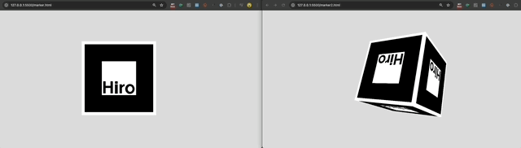
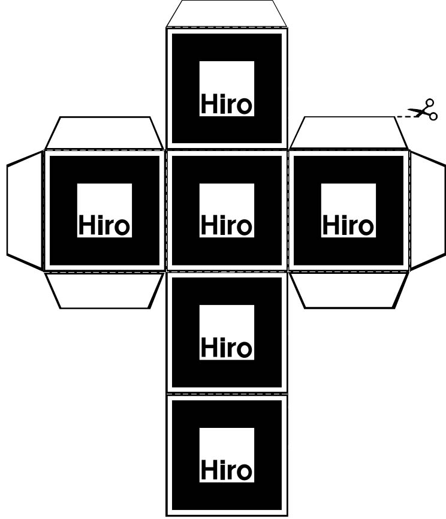
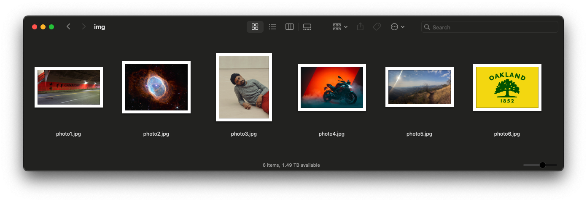
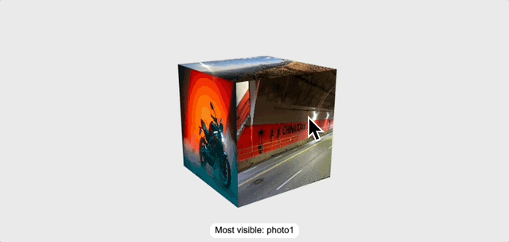

# AR Test: Storytelling with a 3D cube

I used ChatGPT and GitHub CoPilot to try some experiments with interactive 3D dice.

## Let's use AR.js – index.html

[](https://www.youtube.com/watch?v=oBnRrWEfwdw)

I wanted to teach my students how to create something like [57° North – an interactive AR storybook for the Merge Cube](https://www.mightycoconut.com/57north) but the Merge EDU platform was gatekeepy and required a [paid subscription](https://www.mergeedu.com/pricing/edu#compare). ([Twinery.org](https://Twinery.org) is free, open source, and web-based – so I may come back to that.)

So, I tried to use [AR.js](https://ar-js-org.github.io/AR.js-Docs/) to create a 6-sided cube that I could interact with using cube with the same [hiro marker](img/hiro.png) on each side. I created some test markers [[1]](marker.html),[[2]](marker2.html) to point my camera at:



**It did not work.** This was the concept:

1. A user can open [index.html](https://domlet.github.io/ar-test/index.html) on any device with a web browser and a camera. (Go ahead – try it now!)
2. The user must **give the app permission** to activate you device's camera and access the camera image. 
3. Then, the user should **point their camera** at the the `hiro.png` marker. 
4. When the app recognizes the marker in the camera image, it should anchor the 3D experience on that marker. _But, it fails!_

### Why does it fail?

**AR.js** requires persistent visual recogniton of the hiro marker. So, if the marker turns ~90 degrees away from the camera on any axis, the app loses the anchor (and thus the AR graphics disappear). So, while the cube may have 6 sides conceptually, only ONE SIDE, plus a limited (angled) view of 4 other sides is available while the anchor is visible. **It is impossible** to see the 6th (back) side of the cube. Take a look:

[](https://youtube.com/shorts/yXGH10byikM)

## Can we fix it with UI? – index2.html

My next thought was... Well can I [add some UI elements](https://domlet.github.io/ar-test/index2.html) to help the user navigate the experience? This [felt too cumbersome](https://youtube.com/watch?v=a-QU9HRGdNo), so I abandoned the idea before developing the experience further.

I considered two alternatives:

1. **Using JavaScript for "marker handoff"** which means detecting when the `hiro.png` marker is rotated up, down, left, right...

2. **Using 6 unique markers** (one for each of the 6 cube sides) to load 6 different experiences – instead of 1 repeated single marker:



## Just use 3D (without AR) – index3.html

Finally, I ditched AR altogether and used **p5.js** to build an old-fashioned 6-sided cube in 3 dimensions, with different photo textures on each side. 

In [index3.html](https://domlet.github.io/ar-test/index3.html), you can double-click the cube to simulate a dice roll resulting in a single result – but I had an impossible time using CoPilot to script the trigonometry of the x/y/z axes to detect the result (which side of the cube is most visible to the user when the roll is finished). It didn't work well. 

Here's me, trying to train the model with my prompts:

```
when i see 6 console logs 5
when i see 2 console logs 2
when i see 3 console logs 3
when i see 3 console logs 5
when i see 1 console logs 1
when i see 4 console logs 4
when i see 3 console logs 4
when i see 6 console logs 4
when i see 6 console logs 4
when i see 5 console logs 5
when i see 4 console logs 3
when i see 6 console logs 6
when i see 2 console logs 2
when i see 1 console logs 3
when i see 1 console logs 1
when i see 2 console logs 3
when i see 4 console logs 5
when i see 3 console logs 4
```

As an alternative, I tried to have the roll function to pick a random side, and then simply **match the animation to the result** in that side facing the user...but it felt fake, and returned (`image6.jpg`) 100% of the time. I didn't like the idea enough to try fixing those things.

Frustrated, I tried to add a function that would **literally analyze the pixels rendered on the screen** – and detect which image is showing. (I assume this is resource-intensive, but I was willing to be greedy if it worked.) It was better, but still not good enough. Plus, if the images had similar compositions or color profiles, I imagined it could be even worse.




## Let's get out of here – index4.html

For my 4th version, I switched to ChatGPT and used the same approach. [It works better](https://domlet.github.io/ar-test/index4.html), but is still only about 80% accurate:



At this point, the code was out of my control. The app had **multiple functions** to detect the resulting face 😱 and, I had questions I could not answer:

  1. Were **user view** and **camera view** the same thing? I thought they were – so why would the function read the result of the roll so differently than my eyeballs did? 
  2. What is **negative z-index**? 
  3. What the nut 🌰 is **all this trigonometry** and these transformations?

This is when I threw in the towel:

  ```js
    // In view space, camera looks down -Z (common OpenGL convention).
    // So "most visible" means normal points most toward camera = most NEGATIVE z.
    let bestN = faces[0].n;
    let bestScore = Infinity; // we want smallest z

    for (const f of faces) {
      const tv = multMatVec3(m, f.v);  // transformed normal (approx; ok for pure rotations)
      const z = tv[2];

      if (z < bestScore) {
        bestScore = z;
        bestN = f.n;
      }
    }
    return bestN;
  ```

I know that I could understand the spatial math and the camera conventions if I set my mind to it. :)

But, I'm not that programmer. I help students explore game mechanics and experiment with novel digital instruments for storytelling and interaction. In the end, I like to know what's in the weeds, but that's not where I live. I'm now going to learn what we can build with just [Twine](https://www.youtube.com/watch?v=ZnARX2ToqYc&t=68s)!